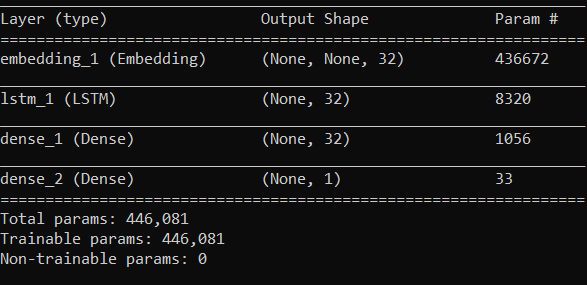
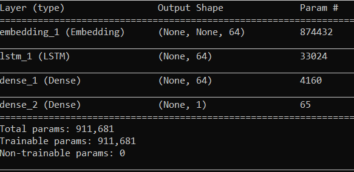

# NLP-Data-Exploration

Data exploration for some sentiment analysis datasets

## Combination of reviews

The first dataset is a small one of **2748** reviews labelled as negative or positive.
The dataset is a combination of amazon ,imdb and yelp reviews.

Using this code we created a unified file to work on later: [exploration_nlp](https://github.com/fabianhoegger/NLP-Data-Exploration/exploration_nlp.py)
The csv file is available here:[multimedia.csv](https://github.com/fabianhoegger/NLP-Data-Exploration/tree/main/datasets/Combination)

## Stanford Dataset

The Stanford dataset is much bigger with **239231** total movie reviews from rotten tomatoes.
The dataset comes with annotated reviews in a score of 0 to 1 meaning:
0-0.2 very negative  0.2-0.4 negative 0.4-0.6 neutral and 0.6-0.8 positive ,0.8-0.1 very positive.
Bellow is a simplified distribution chart

Using this code we created a unified file to work on later: [exploration_stanford](https://github.com/fabianhoegger/NLP-Data-Exploration/exploration_stanford.py)

## US Airline Tweet Dataset

The US Airline tweet dataset is made of **14640** tweets each annotated as positive,neutral or negative .Additionally it has a "negativereason" where it states the reason that a tweet is negative and even a negativereason confidence level column.
Bellow there's a chart showing the percentage of positive,negative and neutral tweets

Data exploration code for this dataset: [explore_tweets](https://github.com/fabianhoegger/NLP-Data-Exploration/explore_tweets.py)

## Random Forest Classification

Using the RandomForestClassifier provided by the sklearn library we tried to train the algorithm with the data preprocessed in different ways and we made some changes in the algorithm's parameters to see how it affected the result.

### Methods

For each dataset there was used a combination of preprocessing methods that are listed bellow

1. __CountVectorizer__(CV)--Stemming--n_est=**50**,max_depth=**20**
2. CV--Lemmatizing--n_est=**50**,max_depth=**20**
3. CV--Stemming--n_est=**150**,max_depth=__None__
4. CV--Lemmatizing--n_est=**150**,max_depth=__None__
5. __TfidfVectorizer__(tfidf)--Stemming--n_est=**50**,max_depth=**20**
6. tfidf--Lemmatizing--n_est=**50**,max_depth=**20**
7. tfidf--Stemming--n_est=**150**,max_depth=__None__
8. tfidf--Lemmatizing--n_est=**150**,max_depth=__None__

*(n_est=number of Randomforest estimators)
### Combination of Reviews

Metrics   | #1   | #2   | #3   | #4   | #5   | #6   | #7   | #8   |
--------- | --   | --   | --   | --   | --   | --   | --   | --   |
Precision | 0.66 | 0.78 | 0.79 | 0.81 | 0.78 | 0.80 | 0.88 | 0.80 |
Recall    | 0.85 | 0.64 | 0.79 | 0.64 | 0.70 | 0.65 | 0.73 | 0.65 |
Accuracy  | 0.72 | 0.73 | 0.80 | 0.75 | 0.75 | 0.73 | 0.80 | 0.73 |
Preprocessing| CV |CV |CV |CV | tfidf| tfidf| tfidf| tfidf|

### Stanford dataset

Metrics   | #1   | #2   | #3   | #4   | #5   | #6   | #7   | #8   |
--------- | --   | --   | --   | --   | --   | --   | --   | --   |
Precision | 0.61 | 0.60 | 0.89 | 0.89 | 0.74 | 0.75 | 0.81 | 0.80 |
Recall    | 0.98 | 0.98 | 0.94 | 0.93 | 0.88 | 0.88 | 0.88 | 0.88 |
Accuracy  | 0.65 | 0.64 | 0.90 | 0.90 | 0.77 | 0.78 | 0.82 | 0.82 |
Preprocessing| CV |CV |CV |CV | tfidf| tfidf| tfidf| tfidf|

### Tweeter Airline Dataset

Metrics   | #1   | #2   | #3   | #4   | #5   | #6   | #7   | #8   |
--------- | --   | --   | --   | --   | --   | --   | --   | --   |
Precision | 1.0  | 1.0  | 0.86 | 0.86 | 0.96 | 1.00 | 0.84 | 0.80 |
Recall    |0.006 |0.002 | 0.62 | 0.64 | 0.17 | 0.01 | 0.63 | 0.61 |
Accuracy  |0.79  |0.78  | 0.89 | 0.90 | 0.83 | 0.80 | 0.90 | 0.89 |
Preprocessing| CV |CV |CV |CV | tfidf| tfidf| tfidf| tfidf|

### Results

Looking at the tables above we can see that there is not a big difference in the results comparing lemmatizing & stemming. For example comparing column #1 and #2 with each other or #3 and #4 with each other there's a minimal difference.On the other hand if you compare columns where there's different parameters you can see an improvement. For instance if you compare #1 and #3 you can see an improvement both in Precision and Accuracy.
The same is true if you compare column #2 and #4  and so on.
For each dataset there's relatively small differences. For example in the last dataset
the recall value for parameters(estimators =150 and depth=None) was close to zero.
__Note__: because 2/3 datasets had also neutral sentences we removed them leading to
the Airline dataset being unbalanced.

## RNN

  Lastly we trained a basic Rnn with the data using as preprocessing only the
  standard keras tokenizer that creates a vocabulary of words in the text and assigns a number
  to it.

  
  

  1.  32 output shaped rnn and softmax in last layer
  2.  64 output shaped rnn and sigmoid in last layer

### Combination of reviews

  Metrics   | #1    | validation | #2   | validation |
  --------- | --    | ---------- | ---- | --------   |
  Precision | 0.5014| 0.5231     |0.9913| 0.8588     |
  Recall    | 1.000 | 1.000      |0.9843| 0.7805     |
  Accuracy  | 0.5014| 0.5164     |0.9877| 0.8036     |

#### Graphs

### Stanford dataset

  Metrics   | #1   | validation | #2   | validation |
  --------- | --   | ---------- | ---- | --------   |
  Precision | 1.0  | 1.0        | 0.9550 | 0.9110   |
  Recall    |0.006 | 0.002      | 0.9590 | 0.9336   |
  Accuracy  |0.79  | 0.78       | 0.9530 | 0.9139   |
105s 1ms/step - loss: 6.9745 - accuracy: 0.5451 - precision_m: 0.5451 - recall_m: 1.0000 - val_loss: 6.8855 - val_accuracy: 0.5485 - val_precision_m: 0.5485 - val_recall_m: 1.0000

#### Graphs

### Tweeter Airline Dataset

  Metrics   | #1   | validation | #2   | validation |
  --------- | --   | ---------- | ---- | --------   |
  Precision |0.2013| 0.2153     |0.9839| 0.8167     |
  Recall    |1.0000|0.9863      |0.9794| 0.6828     |
  Accuracy  |0.2015|0.2178      |0.9922| 0.9095     |

#### Graphs

